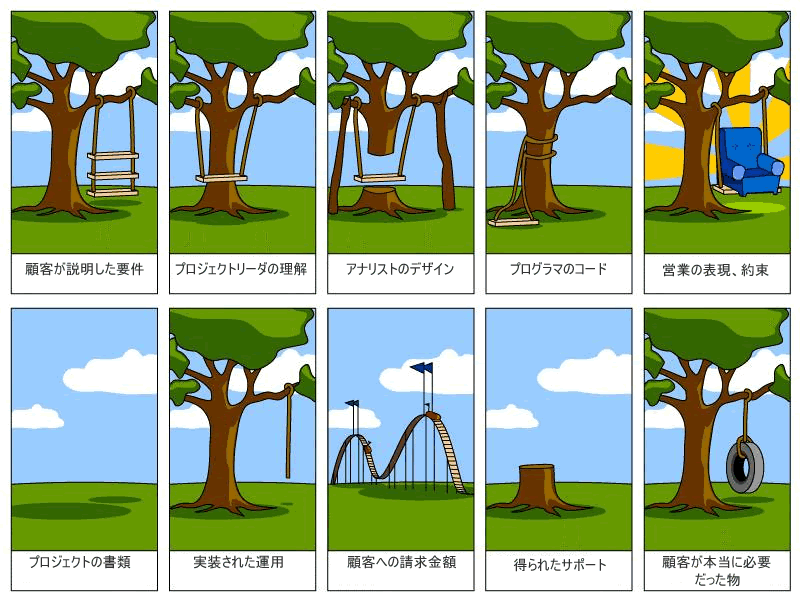

これはIMPL Advent Calendar 2022の１４日目のエントリです。
https://adventar.org/calendars/7404

## 自己紹介
こんにちは、株式会社インプル開発部の佐藤です。

軽く自己紹介をします。

フロントエンド重めでバックエンドも多少やっているシステムエンジニアです。
主にReactやJavaScriptを業務で書いています。

以下の文章は、１年強のエンジニア経験で、最初から意識しておけばよかった事を列挙しています。
今の自分への戒めでもあるので、自分には本当に頑張って欲しいと思っています。

## 言語の思想を把握する
仕事にアサインされると、どうしても最初から実装を要求されます。
そのため、言語仕様などの前提を理解せずに仕事してしまいがちです。

具体的には、「動的型付け」と言う言葉にはてなマークを浮かべたままPHPやJavaScirptを触っていても知識が入ってこないことを指します。

理解せずとも勉強していけばわかると思いますが、そちらの方がレバレッジの効いた方法です。
その上で、できれば自分の手元で触りつつ座学していくのがベターなのではないかと思います。

下記の本は直訳すると「言語の思想」になるので、まさにこの話題の良書だと思います。
気になった方はぜひ見てみてください！

[プリンシプルオブプログラミング](https://amzn.asia/d/iwBmzud)

## ユーザーストーリーを理解する
下記のブランコの画像は有名なので、エンジニアであれば見たことがある人もいるかもしれません。
困ったことに、程度に差はあれど結構ありがちなんですよね、この感じ。

基本的に顧客は自分が本当に欲しいものを把握していません。
そのため、請負の案件などではエンジニアが汲み取って設計, 実装する必要があります。

これは欲しいよなという機能は顧客の頭の中の当たり前だったりするので、まずはユーザー目線に立つことが重要かな、と考えています。

僕の経験から具体例を出すと、ドキュメントの整備やリファクタリングをしていて、後から非同期的に質問が飛んできた時に、「あぁ、確かにこの文章だとここで躓くよな」と思うことがありました。

自分が実際に使う立場に立って考える癖はエンジニアとしてあると、日々の助けになると思います。

基本的に開発の仕事ってそういう部分が多い気がしています。

・ドキュメントを書く -> 見る人のことを考える
・社内組織で活動する -> ユーザーの要望を掬い上げる

こういった細かい気遣いで、改善していく必要があることが多かったです。

みんな大好きオライリー。
結構硬めの文章ですが、家で出来る方法なども書かれているのでおすすめです。

[ユーザーストーリーマッピング](https://amzn.asia/d/1E4aGmM)

## イシューから考える
こんなようなタイトルの本があったと思いますが、ここでは「課題に対して取り組む力」を指しています。

エンジニア１年生だと、どうしても目の前のタスクのことを一直線で考えてしまうと思います。
しかし、タスク単体で考えるのではなく課題に対して俯瞰して考えていくと視野が広がります。

単に振られたバグ修正なども、バグに対して解決の糸口を見つけるだけでなく、現行のシステムでなぜこのようなバグが発生するのかと言うところから考えてみてください。
すると、もしかしたらビジネスロジックの設計から考え直した方が良い場合もあるかもしれません。

本来エンジニアは課題があってそれをITで解決する職業だと思っています。
家でぐうたらしたいが出来ない「課題」を解決するため、IoTを駆使してスマートホーム化する一般人は、もうエンジニアとやっていることはそこまで変わりがありません。

イシューが前提にあってエンジニアがいることを忘れずに、今後も活動していきます。

冒頭に言いましたが、あのようなタイトルの本です。
Amazon Prime会員であればKindleで無料で見ることが出来ます。

[イシューからはじめよ](https://amzn.asia/d/8IPbQwX)
## 最後に
以上が１年前の自分に言い聞かせたいことでした。
個人的にも自分の中でモヤモヤしていた部分を言語化できて、いい機会だったと感じました。

この記事を読んでいる方は、おそらくエンジニアかそれに類する人だと思いますので、一緒に頑張っていきましょう！

ここまで読んでいただき、ありがとうございました！