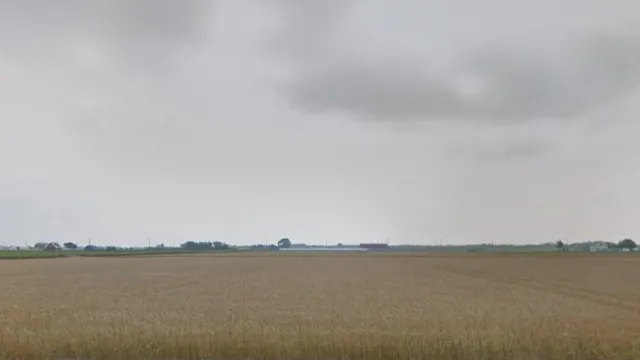
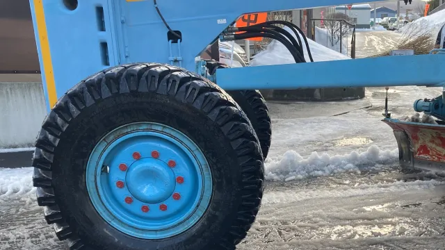
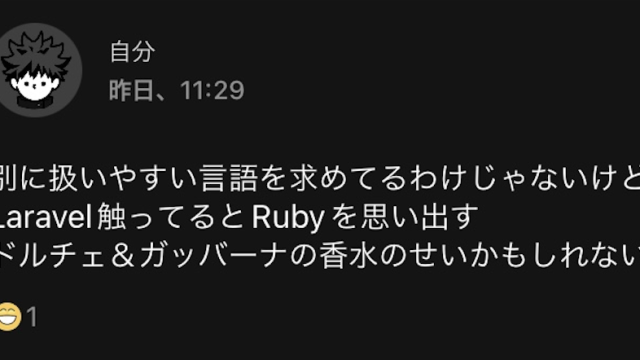
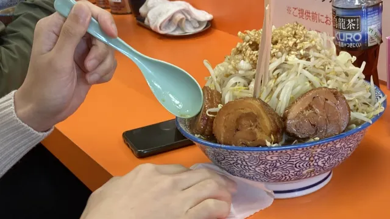

こんにちは、2021 年の 9 月にインプルにシステムエンジニア(SE/PG)として入社した佐藤です。

自社ブログを持っている企業のジョイン記事になんとなく憧れていたので、今回書いてみることにしました。

まずはざっくり自己紹介から始めて、インプルに入ってからの様子とこれからについて書きたいと思います。

## 社会人になる前

・小さい頃は漫画やゲームが好きで、FPS にどハマりしていた
・高校時代は友達もおらず、お昼も一人で食べていた空虚な時代
・大学では農業について学んでいたが、勉強したい領域とのずれを感じたので中退
・プログラマへの憧れはあったものの、凄く文系だったのでプログラマへの偏見から敬遠
・その後、実家の家業である農業に従事

僕は社会人以前の思い出に対して、あまり良い印象を持っていません。

むしろ社会人になってからの方が人生が好転してきています。

今現在大学が楽しくない新卒の人でも、インプルに入れば楽しい可能性は十分にあると思います！

## 第三佐藤産業時代(2018~2020)

実家です（笑）

ここでは半分引きこもりのような形で仕事をしていたので、畑を触るような技術的な農業のお仕事はしていませんでした。

むしろホワイトボードに月次の予定を書いたり、社内コミュニケーションツールに Slack を導入したりとやたら業務管理ばかりしていた覚えがあります。

ただ、父親が LINE もしてないような保守的な人間だったので Slack は浸透せず、ホワイトボードも僕が基本的に管理していたので、僕が退職した際にタスク管理などは父親の頭の中へと移ってしまいました。

IT の力を実際に浸透させたいと思ったのはこの辺りの経験から来ている節があります。

【やってたことまとめ】

・Slack 導入
・施工管理もどき
・ゴリゴリに畑を耕す
・手塩にかけていっぱい育てる
・めっちゃ良い感じにコメを収穫する
・出荷よ〜(´･ω･`)

## 建設会社時代(2020~2021)

実家では月給が３万円しかもらえず、２０歳で月の収入が３万はどう考えてもヤバいと思ったので出稼ぎに行きました。

土木作業自体はとてもつらく、毎日やめたいと思いながら出社していました。

しかし、月給はいい時で４０万近く頂けていたので、金なし家なしスキルなしの２０歳前後で一旦なりふり構わず圧倒的に稼ぎたい人は「土木建設」もしくは「漁師」になると良いんじゃないかなと思います。

僕は１年やって１００万円ほど貯まり、それまでに作っていたポートフォリオが完成したタイミングで退職いたしました。

【やってたことまとめ】

・道路舗装
・札幌市の除雪
・７ヶ月間土を掘って埋める作業

## 株式会社インプル(2021~現在)

ここではインプルに対する主観的な感想を書いていきます。

客観的な視点に関してはインプルのホームページを見れば資料があるので、そちらを参照してください。

### 入社してすぐにコードを書いていた

おそらく、これから普通に入社する方もインターン経験者も関係なく、とりあえず人手の空いている案件に放り込まれます。

基本的に OJT などはなく、チームに入って小さめのタスクをこなすところからスタートするので、最初の１週間くらいは苦労する場合もあるかな〜と個人的には思いました。

特に、スクール出身者でも訓練校卒や独学者でも慣れてないであろう ReactNative を最初に使う可能性がものすごく高いので、とにかく最初は苦労するかと思います。

インプルは基本的に最新技術を取り扱うという思想があるので、所属しているエンジニアは根っから技術者みたいな人が大半を占めています。

早く君もこうなってね^^という会社側からの意思かは分かりませんが、インプルに入ってくる人は全員なんとかなっちゃうタイプの人でした（僕もなれるだろうか…）

未経験者によくある最初に営業をやってね！なんてトラップはないので、とにかく技術技術！！！あああ！！！みたいな貪欲な方はぜひ！

### コードが書けるコミュニケーターが多い

インプルに在籍している技術者は人が良い方が多いので、そういったところが働きやすさを形成しているのかなと思います。

なので、今後インプルに入社したい方はプログラミング能力よりコミュニケーション能力をあげた方が入社しやすいのかもしれません（笑）

また、上司がいないので全員同僚、いうなれば友達のような雰囲気があります。

そういった部分もコミュニケーション力が尊ばれる理由になっていると考えています。

### 主体性や意志力が重要

インプルは柔軟性が高いので、自分が考えたことを自分で行動して実現できれば会社のルールすら変えられてしまいます。

この記事が投稿されているアドベントカレンダーも会社からの発案ではなく、僕や他の方が声をあげて立ち上げられたイベントです。

会社にプラスの影響が出ればその分は評価されますし、頑張った人に頑張った分だけ報酬が出るというのは良い風土だなと個人的には考えております。

### 僕のこれから

今後はとにかく目の前のことに集中して行きたいと考えています。

基本的に視野を広く持てない人間なので、シングルタスクで上へ上へ掘っていくことが一番の近道かなと考えています。

自分のプロジェクトが順調であれば他に何をやってもいいというルールがあるので、余裕ができたらもう少し自分のやりたいことを突き詰めて行きたいなと思っています。

皆様これから長いお付き合いになるかと思いますが、どうぞよろしくお願いします！

