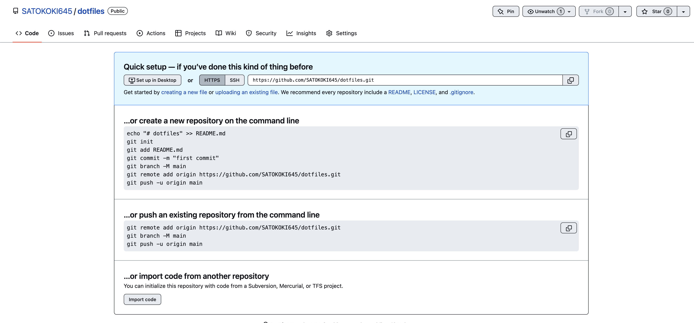

こんにちは、株式会社インプルの佐藤です。

先日、仕事用の PC を変えました。
その時、環境変数の設定方法を忘れ、数時間を溶かしました。
その時の反省も踏まえ、dotfile で管理して快適な開発体験を担保しようと思いました。

## この記事の対象

- よく PC を替える人
- dotfile で管理してみたい人
- 暇な人

## dotfile の作成

さて、早速 dotfile を作成していきます。

それでは GitHub から新しいリポジトリを作成してください。

下記のような形でリポジトリが作成できれば OK です。


## git clone

それでは、新しく作成したリポジトリをクローンしていきます。

```sh
$ git clone https://github.com/SATOKOKI645/dotfiles.git
$ cd dotfile
$ git init
```

これで git 管理に変更することが出来ました。

## dotfile に管理するファイルを保存

今回は zsh のコマンド設定ファイルである`zshrc`を保存していきます。
本来の保存場所は`~/.zshrc`です。

### mv コマンドで移動させる

これで終わりではありません。
本来の場所から dotfile で管理するために移動させたいです。
手動でドラッグしても良いですが、今回は mv コマンドを使います。

```sh
$ mv ~/.zshrc ~/dotfile/${お好きなディレクトリ}
```

これで、dotfile へと移動させることができました。

## dotfile を実行する

設定しただけでは効果はありません。
そのため、効果を発揮させるためのコマンドを実行しなければなりません。

```sh
$ make -C ~/dotfile # linux用のコマンド
```

これで dotfile の効果が発揮されました。

## git 管理のために push する

最後に、git で管理したいので push していきます。

```sh
$ git add .
$ git commit -m "initial commit"
$ git push origin HEAD
```

これで GitHub にアップロードされました。
いつ PC を買い替えても設定を再現できる環境になりましたね！

## さいごに

いかがだったでしょうか？
他にも色々ファイルを展開して、設定ファイルの管理を楽にしていきましょう！
